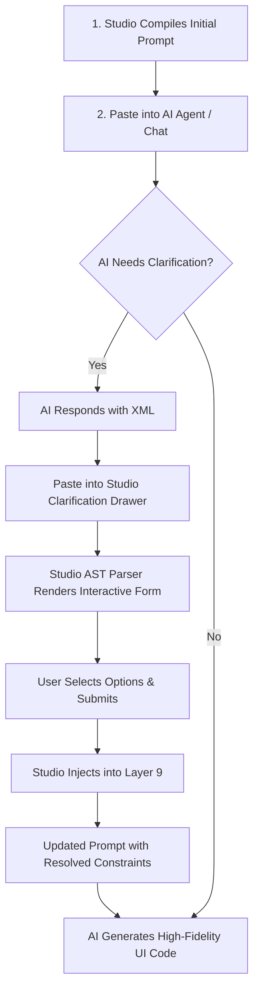

<div align="center">

# Open Studio

**Visual Multi-Layer Prompt Composer & Design System Studio for AI Code Generators**

[](https://react.dev/)
[](https://vite.dev/)
[](https://www.typescriptlang.org/)
[](https://tailwindcss.com/)
[](https://base-ui.com/)
[](https://vitest.dev/)
[](https://github.com/HaiGH-Space/open-design-core-resources)

[Overview](#overview) • [Why Open Studio?](#why-open-studio) • [The 9-Layer Prompt Pipeline](#the-9-layer-prompt-pipeline) • [Interactive Clarification Loop](#interactive-clarification-loop) • [Cockpit Interface](#cockpit-interface) • [Agent Export Presets](#agent-export-presets) • [Design Resources](#design-resources) • [Repository Structure](#repository-structure) • [Getting Started](#getting-started) • [Documentation](#documentation)

> Client-side visual workspace that composes brand-grade design prompts, tokens, and clarification loops for Claude Code, Cursor, Windsurf, ChatGPT, and Antigravity.

</div>

---

## Overview

**Open Studio** is a client-side web application inspired by [Open Design](https://github.com/nexu-io/open-design). It transforms curated design systems, universal UI/UX craft rules, and component blueprints into production-ready prompts for AI-assisted UI development.

Instead of relying on terminal agent CLI daemons that suffer from command line buffer limits and child process hangs, Open Studio provides a visual workspace in your browser. Browse design systems, toggle craft guidelines, specify component shapes, resolve ambiguous requirements interactively, and export a structured prompt with one click—ready to paste into any AI chat or coding agent (Claude Code, Cursor, ChatGPT, Gemini, Antigravity IDE, Windsurf, v0, Lovable, Bolt, etc.).

> [!NOTE]
> Open Studio bundles the catalog of design assets extracted from Open Design via the submodule [`open-design-core-resources`](./open-design-core-resources), featuring **152 curated design systems**, **11 universal craft rulebooks**, **163 skills**, and **114 design templates**.

---

## Why Open Studio?

### The Inspiration: Open Design

[Open Design](https://github.com/nexu-io/open-design) demonstrated that generic coding agents can produce exceptional UI/UX when anchored with machine-readable `DESIGN.md` guidelines, compiled CSS tokens, and curated component blueprints.

### The Bottleneck: Issue #7733

Open Design relies on a local daemon that executes terminal agents (such as Antigravity, Claude Code, or Codex) through child processes. In real-world usage:

- **Command Line Length Failures (Issue #7733):** Composing multi-layer prompts with full token sets, typography ramps, and HTML fixtures quickly exceeds OS command line or child process limits (`spawn ENAMETOOLONG` on Windows and macOS).
- **Subprocess and stdio Deadlocks:** Agent CLI child processes and standard I/O handshakes frequently freeze or crash, resulting in 503 daemon errors.
- **Setup Overhead:** Requiring every team member to install, authenticate, and configure terminal-based CLI daemons creates friction for designers and frontend developers.

### The Open Studio Solution

Open Studio decouples **prompt synthesis** from **agent execution**:

1. **Zero CLI Daemon Dependency:** Runs 100% in the browser. No background daemons, no terminal commands, and zero `ENAMETOOLONG` errors.
2. **Universal Chat & Agent Compatibility:** Produces clean, XML/Markdown-tagged prompts compatible with any AI chat interface or editor pane.
3. **Transparent & Inspectable:** Review and toggle every token, craft guideline, and requirement before sending it to your model.
4. **Token Analytics & Optimization:** Live in-browser token estimation with a Condensed `:root` CSS mode that reduces token usage by ~65% while preserving essential brand tokens.

> [!TIP]
> Frontier chat interfaces (such as Claude 3.7 Sonnet, GPT-4o, Gemini 2.5 Pro, and Antigravity chat) feature large context windows. Pasting a structured, XML-tagged prompt directly into chat yields superior reasoning and styling results without agent spawn overhead.

---

## The 9-Layer Prompt Pipeline

Open Studio synthesizes prompts through a deterministic **9-Layer Composition Engine**. Layers are rendered in a strict precedence hierarchy to prevent conflicting directives:

$$\text{Authoritative UI Constraints (L3)} > \text{User Rules / Brief (L8/L9)} > \text{Brand Contract (L5)} > \text{Craft Discipline (L6)} > \text{Skill Defaults (L7)}$$

| Layer  | Name                              | XML Tag                         | Description                                                                                                                          |
| :----: | :-------------------------------- | :------------------------------ | :----------------------------------------------------------------------------------------------------------------------------------- |
| **L1** | **Security Guardrails**           | `<security-guardrails>`         | Enforces boundary encapsulation against untrusted inputs, script injection, and framework escaping.                                  |
| **L2** | **Runtime Contract**              | `<inspection-runtime-contract>` | Enforces `data-od-id` UI inspection attributes and instructs the model on the `<question-form>` clarification protocol.              |
| **L3** | **Authoritative Constraints**     | `<authoritative-constraints>`   | Hard system overrides: target framework (React, Next.js, Vite, Vue), CSS engine (Tailwind v4, CSS Modules), and viewport settings.   |
| **L4** | **Workflow Stage Manifest**       | `<workflow-stage>`              | Declares task kind (prototype, dashboard, landing, application) and active development phase (discovery, draft, refine, production). |
| **L5** | **Brand Contract**                | `<brand-contract>`              | Ingests brand design system data: `USAGE.md`, `DESIGN.md`, `tokens.css` (Full or Condensed), and component blueprints.               |
| **L6** | **Craft Discipline**              | `<craft-discipline>`            | Universal UI/UX rules: typography hierarchy, anti-AI-slop heuristics, color restraint, motion curves, and accessibility baselines.   |
| **L7** | **Skill & Template Blueprint**    | `<skill-blueprint>`             | Injects specific agent capability workflows (`SKILL.md`) and pre-scaffolded UI layout templates.                                     |
| **L8** | **Persistent User Memory**        | `<user-memory-rules>`           | Custom user design preferences and negative constraints ("Never use gradients", "No floating modals") saved across sessions.         |
| **L9** | **Dynamic Brief & Clarification** | `<task-brief>`                  | Core user objective, feature requirements, and committed `<clarification-answers>` from interactive loops.                           |

---

## Interactive Clarification Loop

When an AI coding agent encounters ambiguous requirements, rather than guessing or defaulting to generic implementations, Open Studio instructs the model to return an embedded `<question-form>` XML block.



1. **AI Question Form Generation:** The model returns a structured question form containing typed questions (radio, checkbox, text, textarea).
2. **Interactive UI Form Rendering:** Open Studio parses the XML into an AST and presents an interactive modal dialog for fast completion.
3. **Structured Answer Serialization:** Submitted answers are serialized into a `<clarification-answers>` block inside Layer 9, eliminating ambiguity before code generation begins.

---

## Cockpit Interface

Open Studio uses a desktop-first, 3-column cockpit workspace designed for rapid configuration and prompt inspection:

```
+------------------------------------------------------------------------------------+
|  Header: Logo | Active Brand | Quick Search (Cmd+K) | Token Meter | Export Preset  |
+--------------------------+------------------------------+--------------------------+
| Left Column (~25%)       | Center Column (~45%)         | Right Column (~30%)      |
| Resource Navigator       | Composer Manager             | Prompt Inspector         |
|--------------------------|------------------------------|--------------------------|
| • Search & Taxonomy Chip | • Quick Presets Bar          | • Agent Preset Switcher  |
| • Tabs: Systems | Rules  | • 9-Layer Accordion Panels   | • Token Budget Gauge     |
| • Brand Cards & Swatches |   - Layer Toggles & Options  | • Per-Layer Breakdown   |
| • Live Preview Modal     |   - Full / Condensed Tokens  | • Syntax-Colored Output  |
|                          | • User Intent Brief Editor   | • 1-Click Clipboard Copy |
|                          | • Clarification Drawer Loop  | • Download Artifacts     |
+--------------------------+------------------------------+--------------------------+
```

- **Resource Navigator:** Instant fuzzy search across 152 design systems and 11 craft rules. Preview color swatches, typography ramps, and CSS variables in a dedicated modal.
- **Composer Manager:** Toggle individual prompt layers, select presets (Landing, Dashboard, Mobile, Deck), edit the intent brief, and paste AI clarification responses.
- **Prompt Inspector:** Monitor live token count and per-layer cost, switch export targets, inspect syntax-highlighted output, and copy or download generated prompts.

---

## Agent Export Presets

Open Studio formats compiled prompts specifically for your target coding workflow:

| Agent Target       | Output Format                                                                              | Downloadable Artifacts                          |
| :----------------- | :----------------------------------------------------------------------------------------- | :---------------------------------------------- |
| **Claude Code**    | Unified prompt with XML delimiters optimized for Claude 3.7 Sonnet extended reasoning mode | `CLAUDE.md`                                     |
| **Cursor**         | Split System Rules and User Task message blocks                                            | `.cursorrules`, `.cursor/rules/open-studio.mdc` |
| **Universal Chat** | Clean Markdown-structured prompt formatted with explicit section delimiters                | Direct Clipboard Copy                           |

---

## Design Resources

All foundational design data is maintained via the [`open-design-core-resources`](./open-design-core-resources) submodule:

| Directory | Count | Description |
| :--- | :---: | :--- |
| [`design-systems/`](./open-design-core-resources/design-systems) | 152 | Packaged brand styles containing `manifest.json`, `DESIGN.md`, and compiled `tokens.css`. |
| [`craft/`](./open-design-core-resources/craft) | 11 | Universal design rules covering typography, color restraint, motion, UX laws, and accessibility. |
| [`design-templates/`](./open-design-core-resources/design-templates) | 114 | Pre-defined artifact shapes (dashboards, landing pages, decks, forms, mobile flows). |
| [`skills/`](./open-design-core-resources/skills) | 163 | Functional agent capabilities and workflow definitions. |
| [`packages/contracts/`](./open-design-core-resources/packages/contracts) | - | TypeScript schemas for tokens, component manifests, and design system contracts. |

---

## Repository Structure

```
open-studio/
├── .agents/                               # Agent skills & workflows
├── docs/                                  # Project documentation & architecture guides
│   ├── codebase/                          # Verifiable codebase knowledge documents
│   │   ├── ARCHITECTURE.md                # 9-layer pipeline & decoupled design
│   │   ├── CONCERNS.md                    # Technical debt, linter warnings & known issues
│   │   ├── CONVENTIONS.md                 # TypeScript, component & styling standards
│   │   ├── INTEGRATIONS.md                # Submodule, storage & browser API contracts
│   │   ├── STACK.md                       # Complete production & dev dependencies
│   │   ├── STRUCTURE.md                   # Directory layout & entry points
│   │   └── TESTING.md                     # Vitest test suite breakdown & running tests
│   ├── intent/
│   │   └── open-studio.md                 # Statement of intent & non-goals
│   └── specs/
│       └── SPEC-open-studio.md            # Detailed technical specification
├── open-design-core-resources/            # Git submodule (design assets & contracts)
│   ├── craft/                             # Universal craft rules
│   ├── design-systems/                    # 152 brand packages
│   ├── design-templates/                  # UI blueprints
│   ├── skills/                            # Agent skills
│   └── packages/contracts/                # Upstream TypeScript schemas
├── scripts/
│   └── generate-catalog.ts                # Catalog indexing build tool
├── tasks/
│   ├── plan.md                            # Implementation plan & milestones
│   └── todo.md                            # Task tracking & checkpoints
├── web/                                   # Vite + React 19 web application
│   ├── public/
│   │   ├── catalog-index.json             # Generated searchable catalog metadata
│   │   └── data/                          # On-demand static assets (design systems, craft)
│   ├── src/
│   │   ├── components/                    # UI primitives, layers, & cockpit views
│   │   ├── context/                       # React state providers
│   │   ├── hooks/                         # Custom application hooks
│   │   ├── lib/                           # Catalog, composer, & clarification engines
│   │   ├── App.tsx                        # Application root
│   │   ├── index.css                      # Tailwind CSS v4 styles
│   │   └── main.tsx                       # Client entry point
│   ├── tests/                             # Vitest test suite (16 files, 303 tests)
│   ├── package.json
│   └── vite.config.ts
└── package.json                           # Root workspace scripts
```

---

## Getting Started

### Prerequisites

- [Node.js](https://nodejs.org/) (v18.0 or higher recommended)
- [pnpm](https://pnpm.io/) (v9 or higher recommended)
- [Git](https://git-scm.com/) with submodule support

### Quick Start

1. **Clone the repository with submodules:**

   ```bash
   git clone --recurse-submodules https://github.com/HaiGH-Space/open-studio.git
   cd open-studio
   ```

   > [!IMPORTANT]
   > If you cloned without `--recurse-submodules`, initialize and pull the core resources using:
   >
   > ```bash
   > git submodule update --init --recursive
   > ```

2. **Install dependencies:**

   ```bash
   pnpm install
   ```

3. **Generate the catalog index:**

   Extracts and indexes all design systems, craft rules, and swatches from the submodule into `web/public/catalog-index.json`:

   ```bash
   pnpm catalog:generate
   ```

4. **Start the development server:**

   ```bash
   pnpm dev
   ```

5. **Run tests and type checks:**

   ```bash
   pnpm test
   pnpm typecheck
   ```

6. **Build for production:**

   ```bash
   pnpm build
   ```

---

## Documentation

For comprehensive technical documentation, refer to the following resources:

- **[Architecture Deep Dive](docs/codebase/ARCHITECTURE.md)**: Detailed examination of the 9-layer engine, precedence rules, and decoupled design.
- **[Technology Stack](docs/codebase/STACK.md)**: Full breakdown of production dependencies, dev tooling, and build scripts.
- **[Codebase Structure](docs/codebase/STRUCTURE.md)**: In-depth directory layout and module boundary definitions.
- **[Code Conventions](docs/codebase/CONVENTIONS.md)**: TypeScript typing guidelines, component slot standards, and styling patterns.
- **[Testing Strategy](docs/codebase/TESTING.md)**: Overview of the 16 test suites, Vitest configuration, and running tests.
- **[Technical Concerns & Debt](docs/codebase/CONCERNS.md)**: Recorded ESLint issues, build warnings, and optimization opportunities.
- **[Integrations Contract](docs/codebase/INTEGRATIONS.md)**: External boundary definitions, submodule contracts, and browser storage.
- **[Technical Specification](docs/specs/SPEC-open-studio.md)**: Formal engineering specification for Open Studio.
