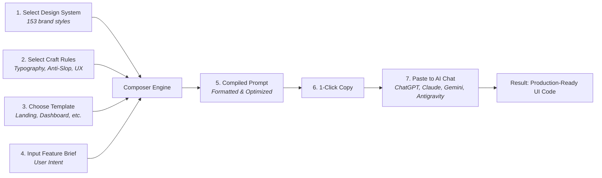

<div align="center">

# Open Studio

**Visual Multi-Layer Prompt Composer & Design System Studio for AI Code Generators**

[](https://react.dev/)
[](https://vitejs.dev/)
[](https://www.typescriptlang.org/)
[](https://tailwindcss.com/)
[](https://ui.shadcn.com/)
[](https://github.com/HaiGH-Space/open-design-core-resources)

[Overview](#overview) • [Why Open Studio?](#why-open-studio) • [Core Features](#core-features) • [Workflow](#workflow) • [Design Resources](#design-resources) • [Repository Structure](#repository-structure) • [Getting Started](#getting-started)

</div>

---

## Overview

**Open Studio** is a lightweight, client-side web application inspired by [Open Design](https://github.com/nexu-io/open-design). It transforms high-quality design systems, universal UI/UX craft rules, and component templates into production-ready prompts for AI-assisted UI development.

Instead of running fragile CLI agent wrappers or bulky local daemons that suffer from execution timeouts and buffer limits, Open Studio provides an interactive visual workspace. Users can browse and select design systems, customize craft guidelines, specify component templates, and instantly export a rich, structured prompt with one click—ready to be pasted into any AI chat interface (ChatGPT, Claude, Gemini, Antigravity IDE, Cursor, Windsurf, v0, Lovable, Bolt, etc.).

> [!NOTE]
> Open Studio bundles the full catalog of design assets extracted from Open Design via the submodule [`open-design-core-resources`](./open-design-core-resources), featuring 153 curated design systems, 13 universal craft rulebooks, 114 design templates, and 107 prompt templates.

---

## Why Open Studio?

### The Inspiration: Open Design

[Open Design](https://github.com/nexu-io/open-design) introduced a groundbreaking concept: converting generic coding agents into aesthetic design engines by providing machine-readable `DESIGN.md` guidelines, compiled CSS tokens, and curated UI templates.

### The Bottleneck: Issue #7733

Open Design relies on a local daemon that executes CLI agents (such as Antigravity, Claude Code, or Codex) via child processes. In practice:

- **Long Prompt Failure (Issue #7733):** When composing multi-layered prompts (combining design tokens, typography rules, component HTML fixtures, and user briefs), the prompt length quickly exceeds the operating system's command line or spawn limits on Windows (`spawn ENAMETOOLONG`).
- **Agent Initialization Hangs:** Stdio MCP handshakes and agent CLI child processes can hang or fail silently, leading to 503 daemon errors and broken user workflows.
- **High Setup Friction:** Requiring every user to install, authenticate, and configure terminal-based CLI agents creates unnecessary barriers for designers and developers.

### The Open Studio Solution

Open Studio decouples **prompt synthesis** from **agent execution**:

1. **Zero CLI Dependency:** No local background daemons, no terminal commands, and no `ENAMETOOLONG` errors.
2. **Universal Chat Compatibility:** By producing clean, semantic, markdown/XML-tagged prompts, any AI chat interface with a web UI or chat pane gains full design context.
3. **Transparent & Inspectable:** Review and fine-tune every token, craft guideline, and requirement before sending it to your model.

> [!TIP]
> Modern chat interfaces (such as Claude 3.7 Sonnet, GPT-4o / o3-mini, Gemini 2.5 Pro, and Antigravity chat) have massive context windows. Pasting a structured prompt directly into chat yields superior reasoning and styling results without agent spawn overhead.

---

## Core Features

- **Visual Multi-Layer Prompt Composer**
  - **Design Systems (153)** — Select curated styles including Linear, Stripe, Apple, Vercel, Bento, Neobrutalism, Cyberpunk, and more.
  - **Universal Craft Knowledge (13 Rules)** — Inject battle-tested UI/UX rules (Anti-AI-Slop, Typography Hierarchy, Color Discipline, Motion & Animation, Accessibility Baseline, Laws of UX, Form Validation).
  - **Design Templates (114)** — Target specific UI shapes (SaaS Landings, Analytics Dashboards, Mobile Onboarding, Pricing Pages, Decks, Interactive Prototypes).
  - **Prompt Templates (107)** — Modular blueprints for image and video generation workflows.
  - **User Intent Brief** — Input custom feature requirements, user stories, and constraints.

- **1-Click Prompt Export (Copy to Clipboard)**
  - Compiles all active layers into an organized, model-friendly prompt format.
  - Formatted with explicit XML tags (e.g., `<design_system>`, `<craft_rules>`, `<specifications>`) for maximum instruction-following fidelity.

- **Live Preview & Design Showcase**
  - Interactive preview for CSS custom properties (`tokens.css`), color ramps, border radiuses, and typography scales.
  - Catalog search and filtering by category, visual aesthetic, and complexity.

- **Fast, Pure Client-Side Architecture**
  - Built with React 19, Vite, Tailwind CSS v4, and TypeScript.
  - Runs entirely in the browser or on static hosting (GitHub Pages, Vercel, Cloudflare Pages) with zero server maintenance and 100% offline capability.

---

## Workflow



1. **Pick a Design Style:** Select from 153 curated design systems matching your desired brand aesthetic.
2. **Toggle Craft Rules:** Opt into essential craft guidelines (e.g., strict accessibility, editorial typography, anti-AI-slop heuristics).
3. **Select an Artifact Template:** Pick the structure you want to generate (e.g., SaaS Landing, Dashboard, Mobile Flow).
4. **Enter Your Requirements:** Describe the product, components, or features you want built.
5. **Copy & Generate:** Copy the unified prompt and paste it directly into your AI chat or coding agent to generate pixel-perfect code.

---

## Design Resources

All foundational design data is managed via the [`open-design-core-resources`](./open-design-core-resources) submodule:

| Directory | Count | Description |
| :--- | :---: | :--- |
| [`design-systems/`](./open-design-core-resources/design-systems) | 153 | Packaged brand styles containing `manifest.json`, `DESIGN.md`, and compiled `tokens.css`. |
| [`craft/`](./open-design-core-resources/craft) | 13 | Universal design rules covering typography, color restraint, motion, UX laws, and accessibility. |
| [`design-templates/`](./open-design-core-resources/design-templates) | 114 | Pre-defined artifact shapes (dashboards, landing pages, decks, forms, mobile views). |
| [`prompt-templates/`](./open-design-core-resources/prompt-templates) | 107 | Modular prompt templates for image and video generation workflows. |
| [`skills/`](./open-design-core-resources/skills) | 163 | Functional agent capabilities and workflow definitions. |
| [`packages/contracts/`](./open-design-core-resources/packages/contracts) | - | TypeScript schemas for tokens, component manifests, and design system contracts. |

---

## Repository Structure

```
open-studio/
├── .agents/                               # Agent skills & workflows
├── open-design-core-resources/            # Git submodule (design assets & contracts)
│   ├── craft/                             # Universal craft rules
│   ├── design-systems/                    # 153 brand packages
│   ├── design-templates/                  # UI blueprints
│   ├── prompt-templates/                  # Image & video prompt blueprints
│   ├── skills/                            # Agent skills
│   └── packages/contracts/                # TypeScript schemas & contracts
└── web/                                   # Vite web application
    ├── public/                            # Static assets
    ├── src/
    │   ├── components/                    # UI components & theme provider
    │   ├── lib/                           # Utility functions
    │   ├── App.tsx                        # Application root
    │   ├── index.css                      # Tailwind CSS v4 styling
    │   └── main.tsx                       # Entry point
    ├── package.json
    └── vite.config.ts
```

---

## Getting Started

### Prerequisites

- [Node.js](https://nodejs.org/) (v18.0 or higher recommended)
- [pnpm](https://pnpm.io/) (or `npm`)
- [Git](https://git-scm.com/) with submodule support

### Installation

1. **Clone the repository with submodules:**

   ```bash
   git clone --recurse-submodules https://github.com/HaiGH-Space/open-studio.git
   cd open-studio
   ```

   > [!IMPORTANT]
   > If you cloned without `--recurse-submodules`, initialize and pull the core resources using:
   >
   > ```bash
   > git submodule update --init --recursive
   > ```

2. **Navigate to the web client directory and install dependencies:**

   ```bash
   cd web
   pnpm install
   # or
   npm install
   ```

3. **Start the development server:**

   ```bash
   pnpm dev
   # or
   npm run dev
   ```

4. **Build for production:**

   ```bash
   pnpm build
   # or
   npm run build
   ```

5. **Type check and lint:**

   ```bash
   pnpm typecheck
   pnpm lint
   ```
