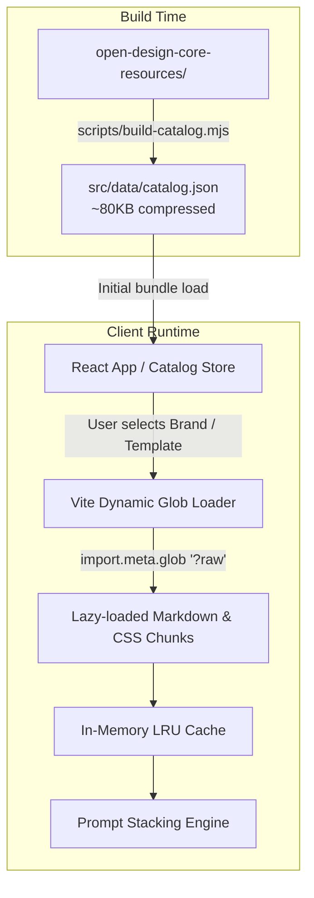

# Specification: Open Studio (Open Design Prompt Studio)

- **Status:** Draft / Ready for Review
- **Version:** 1.0.0
- **Date:** 2026-09-21
- **Skill Reference:** `spec-driven-development`

---

## 1. Objectives & Core Value Proposition

### 1.1 Context & Problem Statement
[Open Design](https://github.com/nexu-io/open-design) curated over 150+ brand design systems, universal craft guidelines, and production templates into machine-readable markdown and CSS files. However, executing this through CLI agent wrappers and local daemons suffers from severe failure modes:
1. **OS Buffer Overflow (Issue #7733):** Passing multi-layered prompts (design tokens, typography guidelines, HTML fixtures, and briefs) to CLI agents (Claude Code, Antigravity, Codex) triggers `spawn ENAMETOOLONG` on Windows and execution buffer truncation on Unix systems.
2. **Daemon Failures & Initialization Hangs:** Stdio MCP handshakes and agent subprocesses frequently hang or emit 503 errors.
3. **High Setup Barrier:** Requiring every designer or developer to install, authenticate, and configure terminal CLI tools limits adoption.

### 1.2 Core Value Proposition
**Open Studio** is a 100% client-side, local-first web application that completely decouples **prompt synthesis** from **agent execution**. It provides an interactive visual studio to browse, customize, and stack design systems, craft guidelines, templates, and feature briefs into a single **Model-Agnostic Universal Standard** prompt. With 1-click copy, users paste production-ready prompts directly into any AI chat interface (ChatGPT, Claude, Gemini, DeepSeek) or coding agent (Cursor, Windsurf, Claude Code, Aider).

### 1.3 Success Criteria
- **Initial Load Performance:** First Contentful Paint < 800ms; initial bundle transfer < 180KB gzip by lazy-loading all raw resource content on demand.
- **Catalog Navigation:** Instant sub-16ms search and category filtering across 151+ brand packages, 13 craft rulebooks, and 114+ templates.
- **Offline & Local-First:** 100% operable offline; zero external network requests, zero telemetry, zero analytics scripts, and zero cloud dependencies.
- **Prompt Fidelity:** Strict adherence to the 8-layer sequential assembly order with zero hallucinated or dropped tokens.
- **Persistence Integrity:** Presets and starred favorites persist across browser refreshes via `localStorage` with JSON export/import capability.

---

## 2. Tech Stack & Commands

### 2.1 Tech Stack
- **Framework:** React 18+ with Vite 6+
- **Language:** TypeScript 5.x (Strict mode)
- **Styling:** Tailwind CSS + Lucide React icons
- **State Management:** React Context / Custom Hooks with structured `localStorage` synchronization
- **Token Estimation:** Offline pure-JavaScript tokenizer (`gpt-tokenizer` for cl100k_base / o200k_base) running off-thread in a dedicated Web Worker with 300ms input debounce + instantaneous character and heuristic estimate fallback
- **Build Utilities:** Node.js 18+ for pre-build catalog manifest generation

### 2.2 Commands
```bash
# Development server (runs catalog build then starts Vite)
npm run dev

# Pre-build catalog metadata generator
npm run build:catalog

# Production build (validates catalog, runs tsc, builds static bundle)
npm run build

# Run unit and integration tests
npm test

# Run tests with coverage
npm run test:coverage

# Lint and type check
npm run lint
npm run typecheck
```

---

## 3. Project Structure

```
open-studio/
├── .agents/                               # Agent skills & workflows
├── docs/                                  # Documentation & ADRs
│   └── intent/
│       └── open-studio.md                 # Confirmed Statement of Intent
├── open-design-core-resources/            # Git Submodule (Read-Only Source)
│   ├── craft/                             # 13 universal craft rulebooks (.md)
│   ├── design-systems/                    # 151+ brand packages (manifest, DESIGN.md, tokens.css)
│   ├── design-templates/                  # 114+ UI blueprints (.md, .html)
│   └── skills/                            # 163+ capability definitions
├── scripts/
│   └── build-catalog.mjs                  # Build-time scanner generating static catalog.json
├── src/
│   ├── assets/                            # Static app icons and graphics
│   ├── components/                        # UI Components
│   │   ├── catalog/                       # Brand & template cards, search, filter chips
│   │   ├── composer/                      # 8-layer toggles, brief editor, craft pills
│   │   ├── preview/                       # Live prompt viewer, syntax highlighter, copy hub
│   │   ├── presets/                       # Preset manager modal & favorites drawer
│   │   └── common/                        # Buttons, modals, tooltips, badges, toasts
│   ├── data/
│   │   └── catalog.json                   # Generated catalog metadata (indexed at build time)
│   ├── engine/                            # Core prompt composition logic
│   │   ├── stacker.ts                     # Strict 8-layer sequential assembly pipeline
│   │   ├── demarcators.ts                 # Model-agnostic XML and Markdown formatting
│   │   ├── tokenizer.ts                   # Tokenizer client with 300ms debounce & Web Worker bridge
│   │   ├── tokenizer.worker.ts            # Dedicated Web Worker for off-thread BPE calculation
│   │   └── loader.ts                      # Vite import.meta.glob on-demand asset fetcher
│   ├── hooks/                             # React custom hooks
│   │   ├── useComposerState.ts            # Active layers, overrides, and brief state
│   │   ├── useFavorites.ts                # Starred brands & templates in localStorage
│   │   └── usePresets.ts                  # Snapshot storage & JSON import/export
│   ├── types/                             # TypeScript interfaces & schemas
│   │   ├── catalog.ts                     # Brand, craft, and template schemas
│   │   ├── composer.ts                    # Layer states, brief, and assembly types
│   │   └── storage.ts                     # localStorage schema contracts
│   ├── App.tsx                            # Root 3-column workspace layout
│   ├── main.tsx                           # React entry point
│   └── index.css                          # Tailwind CSS imports and custom studio theme
├── tests/                                 # Automated tests (Vitest)
│   ├── engine/
│   │   ├── stacker.test.ts                # 8-layer order, conflict resolution, overrides
│   │   ├── demarcators.test.ts            # Delimiter integrity and XML escaping
│   │   └── tokenizer.test.ts              # Token count accuracy
│   └── storage/
│       └── presets.test.ts                # localStorage CRUD and export/import
├── SPEC.md                                # This document
├── package.json
├── tsconfig.json
└── vite.config.ts
```

---

## 4. Resource Directory Architecture & Ingestion Pipeline

### 4.1 Upstream Structure (`open-design-core-resources`)
The application relies on the following upstream directory layouts:
- `design-systems/{brandId}/`:
  - `manifest.json`: Metadata (`name`, `category`, `description`, `craft.suggested`)
  - `DESIGN.md`: Detailed brand aesthetic guidelines and philosophy
  - `tokens.css`: Compiled CSS custom properties
  - `design-tokens.json`: Raw structured token definitions (color swatches, font ramps)
  - `USAGE.md` *(optional)*: Framework constraints and implementation notes
  - `components.manifest.json` / `components.html` *(optional)*: Component fixtures
- `craft/{craftRuleId}.md`: 13 battle-tested UI/UX rulebooks (anti-slop, typography, accessibility, motion, etc.)
- `design-templates/{templateId}/`: 114+ templates containing `SKILL.md` guidelines and `example.html` blueprints.

### 4.2 Ingestion Architecture: Dual-Stage Loading
To keep initial load fast (<180KB) while supporting 151+ design systems, the system separates **metadata indexing** from **raw content loading**:



1. **Stage 1: Build-Time Catalog Manifest (`scripts/build-catalog.mjs`)**
   - Scans all brand folders, extracts `manifest.json`, and extracts up to 4 preview colors from `design-tokens.json` (or `tokens.css` regex fallback: `--bg`, `--surface`, `--accent`, `--primary`).
   - Indexes all 13 craft files with title and summary extracted from frontmatter.
   - Indexes all 114+ templates with category and summary.
   - Outputs a single static `catalog.json` (~80KB compressed).

2. **Stage 2: On-Demand Lazy Asset Loading (`engine/loader.ts`)**
   - Uses Vite's dynamic raw glob:
     ```ts
     const rawAssets = import.meta.glob(
       '/open-design-core-resources/**/*.{md,css,json,html}',
       { query: '?raw', import: 'default' }
     );
     ```
   - When a user selects a brand or template, `loader.ts` requests only the specific asset path.
   - Downloaded raw strings are cached in an in-memory `Map<string, string>` to avoid duplicate network transfers.

---

## 5. The localStorage Data Model

All persisted state is sandboxed under the prefix `open_studio_v1_*` with version tracking to allow safe migrations.

### 5.1 Storage Schemas

```ts
export interface StorageSchemaV1 {
  'open_studio_v1_favorites': FavoritesState;
  'open_studio_v1_presets': Record<string, StudioPreset>;
  'open_studio_v1_draft': ComposerDraftState;
  'open_studio_v1_settings': StudioSettings;
}

export interface FavoritesState {
  version: 1;
  brandIds: string[];        // e.g. ['linear-app', 'stripe', 'apple']
  templateIds: string[];    // e.g. ['saas-landing', 'live-dashboard']
  craftRuleIds: string[];   // e.g. ['anti-ai-slop', 'accessibility-baseline']
}

export interface StudioPreset {
  id: string;               // UUID v4
  name: string;             // User-assigned label (e.g., "SaaS Dark Clean")
  createdAt: number;        // Timestamp ms
  updatedAt: number;        // Timestamp ms
  composerState: ComposerDraftState;
}

export interface ComposerDraftState {
  selectedBrandId: string | null;
  selectedTemplateId: string | null;
  activeCraftRuleIds: string[];
  userBrief: string;
  layerToggles: {
    usage: boolean;
    designMd: boolean;
    tokensCss: boolean;
    components: boolean;
    craftRules: boolean;
    template: boolean;
    guardrails: boolean;
    userGoal: boolean;
  };
  layerOverrides: {
    usage?: string;
    designMd?: string;
    tokensCss?: string;
    components?: string;
    craftRules?: string;
    template?: string;
    guardrails?: string;
    userGoal?: string;
  };
  customGuardrailsText: string;
}

export interface StudioSettings {
  version: 1;
  theme: 'dark' | 'light' | 'system';
  tokenizerModel: 'cl100k_base' | 'o200k_base' | 'heuristic';
  toastDurationMs: number;
  autoSaveDraft: boolean;
}
```

### 5.2 Storage Resilience & Quota Guard
- All `localStorage.setItem` calls are wrapped in a `safeStorageSet` utility that catches `QuotaExceededError`.
- If quota is exceeded, the app warns the user and offers to prune old draft history before failing silently.
- Preset Export & Import: Full JSON import/export modal with schema validation (checking `id`, `name`, `composerState`) prevents malformed JSON from corrupting application state.

---

## 6. The Prompt Stacking Engine & Layer Hierarchy

### 6.1 Strict Sequential Assembly Order
The prompt stacking engine (`engine/stacker.ts`) enforces an 8-layer sequential pipeline designed to provide maximal context depth without overwhelming frontier model attention windows.

```
┌────────────────────────────────────────────────────────┐
│  Layer 1: USAGE Guidelines                             │
│  Framework constraints, CLI setup notes, file paths    │
├────────────────────────────────────────────────────────┤
│  Layer 2: DESIGN.md Brand Philosophy                   │
│  Aesthetic identity, typography hierarchy, density     │
├────────────────────────────────────────────────────────┤
│  Layer 3: tokens.css Design Tokens                     │
│  Raw CSS custom properties, color ramps, radii         │
├────────────────────────────────────────────────────────┤
│  Layer 4: Component Blueprints & Manifest              │
│  Pre-extracted component patterns & HTML fixtures      │
├────────────────────────────────────────────────────────┤
│  Layer 5: Universal Craft Knowledge                    │
│  Active craft rulebooks (Anti-Slop, Accessibility)     │
├────────────────────────────────────────────────────────┤
│  Layer 6: Template / Skill Blueprint                   │
│  Selected structural layout pattern & page anatomy     │
├────────────────────────────────────────────────────────┤
│  Layer 7: System Guardrails & Output Directives        │
│  Code completeness rules, anti-placeholder constraints │
├────────────────────────────────────────────────────────┤
│  Layer 8: User Goal & Feature Brief                    │
│  Custom user feature requirements & stories            │
└────────────────────────────────────────────────────────┘
```

### 6.2 Layer Details & Fallback Logic

| Layer # | Name | Source File | Enabled By Default | Fallback when source missing |
|---|---|---|---|---|
| **Layer 1** | USAGE | `design-systems/{id}/USAGE.md` | Yes | Omit layer gracefully |
| **Layer 2** | DESIGN.md | `design-systems/{id}/DESIGN.md` | Yes | Required if brand selected |
| **Layer 3** | tokens.css | `design-systems/{id}/tokens.css` | Yes | Required if brand selected |
| **Layer 4** | Components | `design-systems/{id}/components.manifest.json` or `components.html` | No (opt-in) | Omit layer gracefully |
| **Layer 5** | Craft Rules | `craft/{id}.md` (multiple) | Yes (anti-slop, accessibility) | Omit if none toggled |
| **Layer 6** | UI Template | `design-templates/{id}/SKILL.md` | Yes | Omit if no template selected |
| **Layer 7** | Guardrails | Built-in configurable directive | Yes | Default Open Design directives (Single-file HTML, `data-od-id` tagging, zero placeholders) |
| **Layer 8** | User Goal | User input textarea | Yes | Placeholder warning if empty |

#### 6.2.1 Layer 7 Default Directives (System Guardrails)
Layer 7 enforces non-negotiable code quality, containment, and inspection rules. The default template contains:
1. **Single-File Output:** All generated code must be delivered as a single, self-contained HTML file with all CSS inside `<style>` and all JavaScript inside `<script>`. No separate files or unbundled relative imports.
2. **Element Tagging (`data-od-id`):** Every key structural tag, section, card, and interactive element MUST include a unique semantic identifier via the attribute `data-od-id="<unique-id>"` (e.g. `<nav data-od-id="main-nav">`, `<button data-od-id="pricing-toggle-annual">`, `<div data-od-id="card-tier-pro">`). This guarantees that generated artifacts are instantly inspectable and compatible with visual selectors and downstream revision workflows.
3. **Zero Placeholders:** Strict ban on ellipsis comments, stubbed functions, or incomplete markup (e.g. no `// TODO: implement rest` or `<!-- Cards 2-5 follow the same pattern -->`).
4. **Token Adherence:** All colors, spacing, borders, and typography must reference the CSS custom properties provided in `<tokens_css>`.

### 6.3 Delimitation Format: Model-Agnostic Universal Standard
To ensure identical parsing accuracy across Claude 3.5/3.7, GPT-4o, Gemini 2.0, DeepSeek R1, and Cursor/Windsurf agents, the engine outputs a **hybrid format**:
- Top-level Markdown section headers (`# SECTION_NAME`) for models that rely on markdown outlines.
- Explicit XML tags (`<section_name> ... </section_name>`) wrapping code blocks and structured instructions, ensuring strict boundaries without token hallucination.

```markdown
# OPEN DESIGN SYSTEM DIRECTIVES

<brand_specification>
<!-- Brand identity, design philosophy, and guidelines from DESIGN.md -->
...
</brand_specification>

<tokens_css>
```css
/* Exact CSS custom properties from tokens.css */
:root {
  --bg: #08090a;
  --surface: #191a1b;
  ...
}
```
</tokens_css>

<craft_rules>
<!-- Active universal UI/UX rules from craft/*.md -->
## Anti-AI-Slop Rules
...
## Accessibility Baseline
...
</craft_rules>

<ui_template>
<!-- Template anatomy and structural specifications -->
...
</ui_template>

<system_guardrails>
<!-- System Guardrails & Output Directives -->
1. Single-File HTML Output: Produce a complete, standalone, production-ready single HTML file with all CSS (<style>) and JavaScript (<script>) embedded. Do NOT split into multiple files.
2. Element Tagging: Add the `data-od-id="<unique-id>"` attribute to all key interactive elements, sections, and structural containers (e.g., `<header data-od-id="navbar">`, `<button data-od-id="primary-cta">`).
3. Production Completeness: Provide fully implemented code without placeholders, stubs, or ellipsis comments.
4. Token Adherence: Strictly use the CSS variables declared in <tokens_css>.
</system_guardrails>

<user_goal>
<!-- User's explicit brief and requirements -->
Build a responsive pricing calculator with 3 tiers and monthly/annual toggles.
</user_goal>
```

### 6.4 Conflict Resolution Rules
1. **Brand Tokens vs. Craft Rules:** If a craft rule recommends standard neutral scales (e.g. standard gray) but the brand `tokens.css` declares custom brand hues (e.g. warm tinted obsidian `#09080b`), **Layer 3 (Brand Tokens) strictly overrides general craft suggestions**. Craft rules govern layout, accessibility, and micro-behavior, while Brand Tokens govern visual palette.
2. **Template vs. Brand Density:** If a template specifies loose cards but the selected brand defines a high-density compact UI (e.g., `trading-terminal`), **Layer 2 (DESIGN.md) takes precedence** for padding and component sizing.
3. **Guardrails Override:** Layer 7 (Guardrails) unconditionally prevents AI models from taking shortcuts (e.g. `// ... rest of code remains the same`).

### 6.5 Token & Character Estimation (Ultra-Long Prompt Optimization)

#### 6.5.1 The Performance Challenge
Assembling a rich brand specification (`DESIGN.md`, `tokens.css`, `components.html`) combined with 4–5 universal craft rulebooks (`craft/*.md`) routinely produces prompts between **15,000 and 40,000+ tokens** (~60KB to 180KB of text). Running pure-JS BPE tokenization (`gpt-tokenizer`) synchronously on the main thread during every keystroke in the brief textarea degrades Interaction to Next Paint (INP), causing frame drops and typing stutter.

#### 6.5.2 Three-Tier Optimization Pipeline
To guarantee a responsive 60/120fps UI with zero typing latency, the estimation engine implements a three-tier architecture:

1. **Tier 1: Instant Synchronous Heuristic (<1ms, Main Thread)**
   - On every keystroke, the UI immediately updates the exact character count (`prompt.length`) and an instantaneous heuristic token count (`Math.round(prompt.length / 3.8)`).
   - Displayed immediately with a subtle status indicator (`~4,200 tokens (est.)`) to ensure zero visual lag.

2. **Tier 2: Off-Thread Web Worker Tokenization (`engine/tokenizer.worker.ts`)**
   - Exact BPE token calculation using `gpt-tokenizer` (`cl100k_base` / `o200k_base`) executes in a dedicated Web Worker off the main thread.
   - Dynamic user inputs (brief textarea and layer raw override inputs) are **debounced by 300ms** before triggering worker computation.
   - Worker messages include a sequence increment `jobId`; if a new keystroke arrives before the worker completes, prior in-flight jobs are cancelled/ignored.

3. **Tier 3: Layer-Level Base Token Caching**
   - Layers 1 through 7 (Brand specs, tokens, craft rules, template blueprint, guardrails) are static until the user toggles a layer or picks a new brand.
   - The engine caches the token count of the static base (`layers 1..7`). When the user types into Layer 8 (User Brief), only the delta/brief needs to be tokenized and added to the cached base sum, reducing worker computation time by >85%.

#### 6.5.3 Visual Context Gauge
- **Green (< 8,000 tokens):** Compact, fits all basic model tiers.
- **Blue (8,000 - 32,000 tokens):** Standard rich design prompt, optimal for Claude 3.5/3.7, GPT-4o, Gemini 2.0.
- **Amber (32,000 - 64,000 tokens):** Heavy prompt with full component fixtures and multiple craft books.
- **Red (> 128,000 tokens):** Approaching maximum context thresholds for older models.

---

## 7. Core Screens, Layout, and UI States

### 7.1 Studio Workspace Layout (3-Column Grid)
Open Studio utilizes a full-viewport, 3-column workspace with collapsible side panels:

```
┌──────────────────────────────────────────────────────────────────────────────────────────────────────────┐
│  HEADER: Open Studio Logo | Preset Selector Dropdown | Starred Drawer | Theme Toggle | GitHub Submodule  │
├──────────────────────────┬───────────────────────────────────────────┬───────────────────────────────────┤
│ COLUMN 1: CATALOG        │ COLUMN 2: COMPOSER LAYERS                 │ COLUMN 3: PROMPT PREVIEW          │
│ (320px - 380px)          │ (460px - 600px, flex-grow)                │ (420px - 560px)                   │
├──────────────────────────┼───────────────────────────────────────────┼───────────────────────────────────┤
│ • Search input (fuzzy)   │ • Layer 1: USAGE (Toggle / Edit)          │ • Header: Token Badge (~4,250)    │
│ • Category Filter Chips  │ • Layer 2: Brand Specs (Active Brand)     │ • Action Bar:                     │
│   (SaaS, Dark, Brutal)   │ • Layer 3: Tokens.css (Code viewer)       │   [ 📋 Copy Prompt ] (Primary)    │
│ • Brand Cards List:      │ • Layer 4: Components Manifest (Toggle)   │   [ ⬇ Export .md / .txt ]         │
│   - Brand Name           │ • Layer 5: Craft Rules (Multi-select)     │   [ 💾 Save as Preset ]           │
│   - 4-Color Swatch Bar   │ • Layer 6: Template Picker (Dropdown)     │ • Syntax-Highlighted Prompt View  │
│   - Category Badge       │ • Layer 7: Guardrails (Configurable)      │ • Jump-to-Layer Navigation        │
│   - ⭐ Star favorite     │ • Layer 8: Feature Brief (Textarea)       │                                   │
└──────────────────────────┴───────────────────────────────────────────┴───────────────────────────────────┘
```

### 7.2 Component Breakdown
1. **Brand Card (`Catalog/BrandCard.tsx`):**
   - Displays brand name, category, and a mini 4-color palette swatch (`bg`, `surface`, `accent`, `text`).
   - Clicking selects the brand; star icon toggles local favorite status.
2. **Layer Manager (`Composer/LayerAccordion.tsx`):**
   - Each layer features an on/off switch, an expand/collapse toggle, and an "Override Raw" edit mode allowing the user to modify the markdown text directly before assembly.
3. **Craft Rule Selector (`Composer/CraftPills.tsx`):**
   - Grid of toggleable badges representing the 13 craft rules (Anti-AI-Slop, Typography, Accessibility, Motion, Laws of UX, etc.) with tooltips explaining each rule's effect.
4. **Action Hub & Preview (`Preview/PromptPreview.tsx`):**
   - Displays assembled text in a monospace viewer.
   - Primary "Copy Prompt" button with animated checkmark and micro-toast notification.
   - Download dropdown offering `.md` (complete with frontmatter) and `.txt`.

### 7.3 UI States
- **Catalog Loading:** Shimmer skeleton cards while `catalog.json` loads.
- **Empty Search:** Informative message ("No design systems match 'xyz'") with a "Clear Search" button.
- **Layer Loading:** Subtle inline spinner when fetching on-demand markdown/CSS files for a selected brand.
- **Copy Success:** Button changes to green checkmark ("Copied 4,820 tokens!") for 2.5 seconds with audio-free haptic feedback.

---

## 8. Code Style & Conventions

### 8.1 TypeScript & React Conventions
- **Functional Components:** React 18 functional components with typed props.
- **State Separation:** Keep pure prompt assembly algorithms in `src/engine/` without React dependencies for 100% testability.
- **Naming:**
  - Components: PascalCase (`BrandCard.tsx`)
  - Hooks: camelCase starting with `use` (`useComposerState.ts`)
  - Utilities & Engine: camelCase (`stacker.ts`, `tokenizer.ts`)
  - Types: PascalCase (`StudioPreset`, `ComposerDraftState`)

### 8.2 Architectural Boundaries

#### Always Do:
- Validate that all prompt assembly runs synchronously once raw assets are loaded.
- Sanitize and escape user brief input to prevent unintentional XML tag closure exploits.
- Provide sensible defaults (e.g. Linear or Default brand selected, Anti-AI-Slop craft rule enabled).
- Keep initial bundle size under 200KB gzip.

#### Ask First:
- Modifying or adding files directly inside the `open-design-core-resources` git submodule (it must remain pristine).
- Introducing third-party UI component libraries (e.g. Radix, MUI) that could bloat bundle size.

#### Never Do:
- Include any external network tracking, Google Analytics, or third-party telemetry scripts.
- Make external API calls or send user prompts to cloud servers.
- Truncate prompt layers without explicit user action or warning.

---

## 9. Testing Strategy

### 9.1 Test Tooling & Coverage
- **Runner:** Vitest with jsdom environment.
- **Assertions:** `@testing-library/react` and native Vitest assertions.
- **Target Coverage:**
  - `src/engine/*`: ≥95% branch coverage (Prompt Stacker, Delimiters, Tokenizer).
  - `src/hooks/*`: ≥90% coverage for storage synchronization and preset management.

### 9.2 Critical Test Cases
1. **Strict 8-Layer Order Test (`tests/engine/stacker.test.ts`):**
   - Verify that Layer 1 appears before Layer 2, Layer 2 before Layer 3, etc.
   - Verify that disabled layers are completely omitted from the output.
   - Verify that layer overrides replace default content without altering the other layers.
2. **Delimiter & Escaping Integrity (`tests/engine/demarcators.test.ts`):**
   - Verify all opened XML tags (`<brand_specification>`, `<tokens_css>`) have matching closing tags.
   - Verify user brief containing `</user_goal>` is properly escaped or handled.
3. **Catalog Build Script Validation (`tests/engine/catalog.test.ts`):**
   - Test that `scripts/build-catalog.mjs` successfully parses all 151+ brand folders without throwing exceptions.
   - Test that preview colors are valid hex/rgb strings.
4. **Storage & Presets Persistence (`tests/storage/presets.test.ts`):**
   - Verify saving, reading, updating, and deleting presets in `localStorage`.
   - Verify invalid JSON import does not crash the application.
5. **Tokenizer Performance & Debounce (`tests/engine/tokenizer.test.ts`):**
   - Verify that instant heuristic estimation returns synchronously in <1ms.
   - Verify debounced worker calculation triggers only after 300ms of rapid typing events settle.
   - Verify base layer token caching correctly adds brief delta without full re-tokenization.

---

## 10. Explicit Non-Goals

The following features are **explicitly out of scope** for Open Studio:
1. **In-App LLM Streaming & Chat Execution:** Open Studio does not call OpenAI, Anthropic, or OpenRouter APIs directly. It is a dedicated prompt composer and design system studio, not a chat client.
2. **Terminal Agent Subprocess Spawning:** No local daemons, stdio MCP handshakes, or child CLI process execution.
3. **Cloud Database & User Authentication:** No accounts, passwords, Supabase, or Firebase backends. Everything is stored locally in the user's browser.
4. **Visual WYSIWYG Drag-and-Drop Page Builder:** Open Studio does not render live React components in an editable canvas; it outputs structured prompts for AI models to generate the code.
