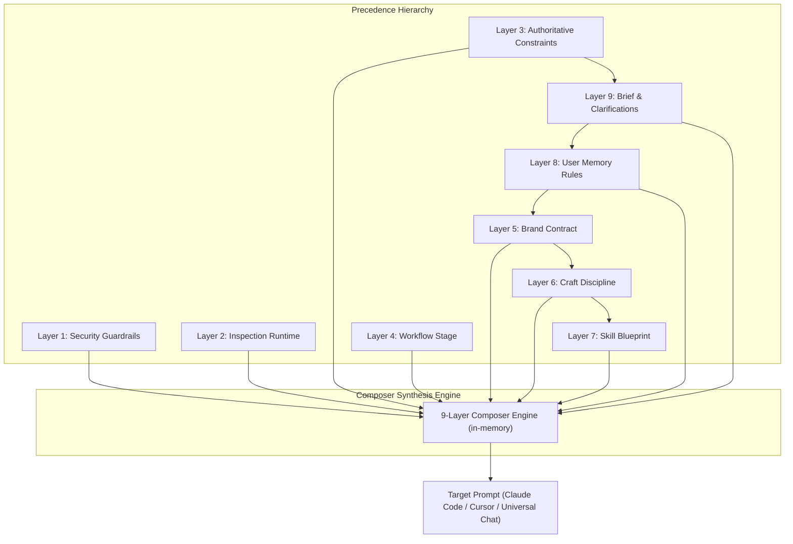

# System Architecture & Design Decisions

## Overview
Open Studio is an in-browser prompt engineering and design system cockpit for AI coding agents. It compiles brand guidelines, design tokens, universal craft heuristics, and interactive clarification answers into deterministic, production-ready prompts without any backend runtime.

---

## Architectural Problem & Context

### The Upstream Bottleneck (Issue #7733)
Predecessors like Open Design rely on local Node.js daemon processes that spawn terminal agents (Claude Code, Antigravity, Codex) via subprocess child processes. In real-world multi-layer prompt synthesis:
- **OS Command Line Buffer Limits:** When compiling complete design token sets, typography ramps, and component fixtures, prompt payloads easily exceed OS command buffer limits (`spawn ENAMETOOLONG` on Windows and macOS).
- **Subprocess and stdio Deadlocks:** Child process wrappers frequently hang on standard input/output handshakes, leading to daemon crashes and HTTP 503 errors.
- **Environment Fragility:** Terminal agent installations create friction across distributed teams.

### The Decoupled Client-Side Solution
Open Studio decouples **prompt synthesis** from **agent execution**:
1. **100% Client-Side:** Compiles in-memory inside the browser. No daemons, no child processes, zero `ENAMETOOLONG` errors.
2. **Universal Portability:** Generates standard XML/Markdown prompts consumable by any AI chat or IDE agent (Claude 3.7 Sonnet, Cursor, ChatGPT, Gemini, Antigravity IDE, Windsurf).
3. **On-Demand Lazy Ingestion:** Large design system files (`DESIGN.md`, `tokens.css`) are fetched statically on demand, keeping initial application payload small.

---

## The 9-Layer Prompt Pipeline

Prompts are synthesized through a deterministic pipeline consisting of 9 distinct layers. Conflicting instructions are resolved through a strict precedence hierarchy:

$$\text{Authoritative Constraints (L3)} > \text{User Rules / Brief (L8/L9)} > \text{Brand Contract (L5)} > \text{Craft Discipline (L6)} > \text{Skill Defaults (L7)}$$



### Layer Specifications

| Layer | Name | XML Tag | Responsibility |
| :---: | :--- | :--- | :--- |
| **L1** | **Security Guardrails** | `<security-guardrails>` | Enforces boundary encapsulation against untrusted input, prompt injections, and shell escapes. |
| **L2** | **Runtime Contract** | `<inspection-runtime-contract>` | Enforces `data-od-id` UI inspection attributes and instructs the model on the `<question-form>` clarification protocol. |
| **L3** | **Authoritative Constraints** | `<authoritative-constraints>` | Hard technical constraints: target framework (React, Next.js, Vite, Vue), CSS engine (Tailwind v4, CSS Modules), and viewport constraints. |
| **L4** | **Workflow Stage Manifest** | `<workflow-stage>` | Declares task archetype (prototype, dashboard, landing, app) and lifecycle phase (discovery, draft, refine, production). |
| **L5** | **Brand Contract** | `<brand-contract>` | Ingests selected brand data: `USAGE.md`, `DESIGN.md`, `tokens.css` (Full or Condensed :root mode), and component blueprints. |
| **L6** | **Craft Discipline** | `<craft-discipline>` | Universal UI/UX rules: typography hierarchy, anti-AI-slop heuristics, color restraint, motion curves, and accessibility baselines. |
| **L7** | **Skill & Blueprint** | `<skill-blueprint>` | Injects specific agent capability workflows (`SKILL.md`) and pre-scaffolded UI layout templates. |
| **L8** | **Persistent User Memory** | `<user-memory-rules>` | Custom user design preferences and negative constraints ("Never use floating pill buttons") persisted in `localStorage`. |
| **L9** | **Dynamic Brief & Clarification** | `<task-brief>` | Core user objective, feature requirements, and committed `<clarification-answers>` from interactive loops. |

---

## Interactive Clarification Loop

When an AI coding agent detects ambiguous requirements, Open Studio instructs the model (via Layer 2) to respond with an embedded `<question-form>` XML payload instead of guessing.

```mermaid
sequenceDiagram
    autonumber
    actor User
    participant Studio as Open Studio Cockpit
    participant Agent as AI Coding Agent / Chat
    
    User->>Studio: Selects Design System & Configures Brief
    Studio->>User: Emits Compiled Multi-Layer Prompt
    User->>Agent: Pastes Prompt into Agent Chat
    Agent-->>User: Returns <question-form> XML block
    User->>Studio: Pastes XML into Clarification Drawer
    Note over Studio: question-form-parser extracts AST
    Studio->>User: Renders Dynamic Interactive Form (radios, checks, inputs)
    User->>Studio: Selects choices & clicks Submit
    Note over Studio: serializer generates <clarification-answers>
    Studio->>Studio: Injects answers into Layer 9
    Studio->>User: Copies Updated Prompt
    User->>Agent: Pastes updated prompt; Agent generates precise UI code
```

---

## State Management & Reactive Data Flow

1. **`CatalogContext`**:
   - Manages asynchronous catalog loading (`web/public/catalog-index.json`).
   - Caches static asset requests (`DESIGN.md`, `tokens.css`) using an in-memory Map cache in `CatalogService`.
2. **`ComposerContext`**:
   - Maintains the complete configuration state of all 9 layers.
   - Debounces prompt compilation (`100ms`) to maintain 60 FPS UI responsiveness while typing.
   - Calculates real-time token metrics using `token-counter.ts` with per-layer breakdown.
3. **Target Exporters**:
   - **Claude Code**: Delimited single prompt format optimized for Claude 3.7 Sonnet, downloadable as `CLAUDE.md`.
   - **Cursor**: Split System and User prompt blocks, downloadable as `.cursorrules` or `.cursor/rules/open-studio.mdc`.
   - **Universal Chat**: Clean markdown-tagged prompt formatted for web chat windows.

---

## Evidence & Verification Sources

- Intent and architecture statement: [`docs/intent/open-studio.md`](../intent/open-studio.md)
- Formal specification: [`docs/specs/SPEC-open-studio.md`](../specs/SPEC-open-studio.md)
- Composer Engine: [`web/src/lib/composer/9-layer-composer.ts`](../../web/src/lib/composer/9-layer-composer.ts)
- Clarification Parser & Serializer: [`web/src/lib/clarification/question-form-parser.ts`](../../web/src/lib/clarification/question-form-parser.ts), [`web/src/lib/clarification/serializer.ts`](../../web/src/lib/clarification/serializer.ts)
- Exporter Engine: [`web/src/lib/composer/exporters.ts`](../../web/src/lib/composer/exporters.ts)
