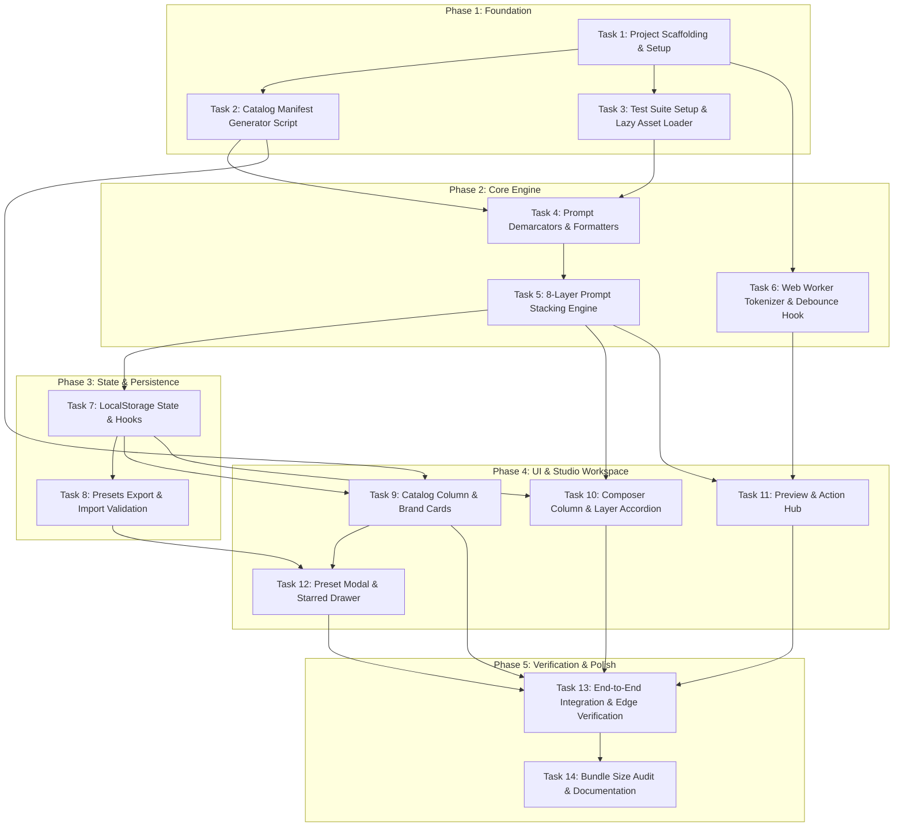

# Implementation Plan: Open Studio (Open Design Prompt Studio)

- **Status:** Draft / Ready for Review
- **Date:** 2026-09-21
- **Specification:** [SPEC.md](file:///d:/Dev/JS/open-studio/SPEC.md)
- **Skill Reference:** `planning-and-task-breakdown`

---

## 1. Overview
Open Studio is a 100% client-side, local-first web application built with React, Vite, TypeScript, and Tailwind CSS. It decouples prompt synthesis from CLI agent execution, allowing users to visually index, browse, customize, and stack 151+ brand design systems, 13 universal craft rulebooks, and 114+ templates into a single Model-Agnostic Universal Standard prompt with one-click copy into frontier AI chat interfaces (Claude, ChatGPT, Gemini, DeepSeek) and coding agents (Cursor, Windsurf, Claude Code, Aider).

---

## 2. Architecture & Design Decisions

1. **Dual-Stage Resource Ingestion:**
   - Pre-build script (`scripts/build-catalog.mjs`) scans `open-design-core-resources/` at build time to produce a compact JSON index (`src/data/catalog.json`, ~80KB) containing lightweight brand metadata and color swatches.
   - Vite dynamic glob (`import.meta.glob('/open-design-core-resources/**/*.{md,css,json,html}', { query: '?raw', import: 'default' })`) lazy-loads heavy markdown and CSS files only when a brand or template is selected.
2. **Strict 8-Layer Prompt Stacking Engine:**
   - Assembly strictly follows: Layer 1 (USAGE) → Layer 2 (DESIGN.md) → Layer 3 (tokens.css) → Layer 4 (Components) → Layer 5 (Craft rules) → Layer 6 (Template blueprint) → Layer 7 (System Guardrails) → Layer 8 (User Goal).
   - Layer 7 default content enforces single-file HTML output and `data-od-id="<unique-id>"` element tagging.
3. **Off-Thread Tokenization (Ultra-Long Prompt Support):**
   - Three-tier estimation: Instant synchronous character + heuristic counter (<1ms), followed by 300ms debounced off-thread BPE calculation via dedicated Web Worker (`engine/tokenizer.worker.ts`), paired with static base layer token caching.
4. **Local-First Sandboxed Persistence:**
   - Everything persists in `localStorage` under `open_studio_v1_*`. Presets store only state configuration (IDs and custom brief text), not raw file contents, preventing storage quota exhaustion. Full JSON export/import is provided for presets.

---

## 3. Dependency Graph

---

## 4. Phased Task Breakdown

### Phase 1: Foundation & Project Scaffolding

#### Task 1: Project Scaffolding & Configuration
- **Description:** Initialize Vite + React + TypeScript + Tailwind CSS project with strict TypeScript settings, Lucide React icons, and paths configuration.
- **Acceptance Criteria:**
  - `package.json` contains Vite, React 18/19, TypeScript, Tailwind CSS, `gpt-tokenizer`, and `lucide-react`.
  - Tailwind CSS configured and loaded in `src/index.css`.
  - Vite dev server starts with `npm run dev` and static build succeeds with `npm run build`.
- **Verification:**
  - `npm run build` succeeds without type errors.
- **Dependencies:** None
- **Files Touched:** `package.json`, `vite.config.ts`, `tsconfig.json`, `tailwind.config.js`, `src/index.css`, `src/main.tsx`, `src/App.tsx`
- **Estimated Scope:** Medium (4-5 files)

#### Task 2: Build-Time Catalog Generator (`scripts/build-catalog.mjs`)
- **Description:** Write the Node.js script that scans `open-design-core-resources/`, extracts metadata from all 151+ brand `manifest.json` and `design-tokens.json` files (4-color preview swatches: `--bg`, `--surface`, `--accent`, `--text`), parses 13 craft rules, and indexes 114+ templates into `src/data/catalog.json`.
- **Acceptance Criteria:**
  - `scripts/build-catalog.mjs` runs via `npm run build:catalog`.
  - Output `src/data/catalog.json` contains all 151+ design systems, 13 craft rulebooks, and 114+ templates.
  - Generates valid color swatches with safe fallbacks when tokens are missing.
- **Verification:**
  - `node scripts/build-catalog.mjs` generates valid JSON; file size < 120KB.
- **Dependencies:** Task 1
- **Files Touched:** `scripts/build-catalog.mjs`, `src/types/catalog.ts`, `package.json`
- **Estimated Scope:** Small (2-3 files)

#### Task 3: Test Suite Setup & Lazy Asset Loader
- **Description:** Setup Vitest with jsdom environment and implement `src/engine/loader.ts` using Vite's `import.meta.glob('/open-design-core-resources/**/*.{md,css,json,html}', { query: '?raw', import: 'default' })` with an in-memory cache.
- **Acceptance Criteria:**
  - Vitest test runner configured and executes with `npm test`.
  - `loader.ts` provides `loadBrandAsset(brandId, filename)` and `loadCraftRule(craftId)`.
  - Normalizes forward/backward slashes for cross-platform Windows/Unix compatibility.
  - In-memory cache returns cached string on subsequent calls without re-fetching.
- **Verification:**
  - `npm test` runs and passes unit tests for `loader.ts`.
- **Dependencies:** Task 1
- **Files Touched:** `vite.config.ts`, `src/engine/loader.ts`, `tests/engine/loader.test.ts`
- **Estimated Scope:** Small (3 files)

### Checkpoint: Foundation
- [ ] Build catalog script executes cleanly and indexes 151+ brands.
- [ ] Dev server starts and bundles `src/data/catalog.json`.
- [ ] Vitest test runner configured and passes initial suite.

---

### Phase 2: Core Engine & Tokenization

#### Task 4: Model-Agnostic Prompt Demarcators & Formatters
- **Description:** Implement `src/engine/demarcators.ts` providing XML and Markdown formatting helpers for each layer with sanitization and closing tag verification.
- **Acceptance Criteria:**
  - Implements `wrapXmlTag(tagName, content, attributes?)` and `wrapMarkdownSection(title, content)`.
  - Correctly produces standard sections: `<brand_specification>`, `<tokens_css>`, `<craft_rules>`, `<ui_template>`, `<system_guardrails>`, and `<user_goal>`.
  - Escapes accidental premature XML closing tags inside user brief inputs.
- **Verification:**
  - Unit tests in `tests/engine/demarcators.test.ts` verify tag symmetry and input escaping.
- **Dependencies:** Task 1
- **Files Touched:** `src/engine/demarcators.ts`, `tests/engine/demarcators.test.ts`
- **Estimated Scope:** Small (2 files)

#### Task 5: Strict 8-Layer Prompt Stacking Engine
- **Description:** Implement `src/engine/stacker.ts` adhering to the exact sequential order (Layers 1 to 8), layer enable/disable toggles, raw layer overrides, and default Layer 7 Open Design guardrails (Single-file HTML, `data-od-id` tagging, zero placeholders).
- **Acceptance Criteria:**
  - Strictly outputs layers in sequence: USAGE → DESIGN.md → tokens.css → Components → Craft Rules → UI Template → Guardrails → User Goal.
  - Disabled layers are omitted without leaving empty tags or broken section headers.
  - Layer overrides replace source content directly.
  - Layer 7 includes the non-negotiable Open Design default directives.
- **Verification:**
  - `tests/engine/stacker.test.ts` validates order, overrides, and layer omission.
- **Dependencies:** Task 3, Task 4
- **Files Touched:** `src/engine/stacker.ts`, `src/types/composer.ts`, `tests/engine/stacker.test.ts`
- **Estimated Scope:** Medium (3 files)

#### Task 6: Web Worker Tokenizer & Debounce Hook
- **Description:** Implement off-thread token estimation via `src/engine/tokenizer.worker.ts` utilizing `gpt-tokenizer` (`cl100k_base` / `o200k_base`), paired with `src/engine/tokenizer.ts` providing instant heuristic feedback and 300ms debounced worker computation with layer-level base caching.
- **Acceptance Criteria:**
  - Instant heuristic token estimate (`Math.round(prompt.length / 3.8)`) returned synchronously in <1ms.
  - Dedicated Web Worker computes exact BPE tokens off the main UI thread.
  - Debounce mechanism delays worker invocation by 300ms during active typing.
  - Sequence `jobId` cancels or ignores obsolete in-flight calculations.
  - Base token cache for static Layers 1–7 drastically accelerates updates when editing Layer 8.
- **Verification:**
  - `tests/engine/tokenizer.test.ts` validates heuristic speed, worker calculation, and debounce consolidation.
- **Dependencies:** Task 1
- **Files Touched:** `src/engine/tokenizer.ts`, `src/engine/tokenizer.worker.ts`, `tests/engine/tokenizer.test.ts`
- **Estimated Scope:** Medium (3 files)

### Checkpoint: Core Engine
- [ ] 8-layer assembly verified with unit tests.
- [ ] Delimiter escaping prevents XML malformation.
- [ ] Tokenizer runs off-thread without freezing UI on 40,000 token test fixtures.

---

### Phase 3: State Management & Persistence

#### Task 7: LocalStorage State & Custom Hooks
- **Description:** Implement custom hooks for state management and local persistence (`useComposerState`, `useFavorites`, `usePresets`) with sandboxed keys (`open_studio_v1_*`), default state initialization, and `QuotaExceededError` handling.
- **Acceptance Criteria:**
  - `useFavorites`: Toggle and query favorite brands, templates, and craft rules.
  - `useComposerState`: Manages selected brand, template, active craft rules, layer toggles, layer overrides, and user brief text with automatic draft saving.
  - Safe `localStorage` wrapper catches quota exceptions gracefully.
- **Verification:**
  - `tests/storage/persistence.test.ts` tests saving, loading, and quota safety.
- **Dependencies:** Task 5
- **Files Touched:** `src/hooks/useComposerState.ts`, `src/hooks/useFavorites.ts`, `src/hooks/usePresets.ts`, `src/utils/storage.ts`, `tests/storage/persistence.test.ts`
- **Estimated Scope:** Medium (5 files)

#### Task 8: Presets Export & Import Validation
- **Description:** Implement full Studio Preset snapshot saving/loading and JSON export/import utilities with strict runtime schema validation.
- **Acceptance Criteria:**
  - Users can save current studio configuration as a named preset.
  - Presets list supports loading, renaming, and deleting.
  - Export all presets or single preset as downloadable JSON.
  - Import JSON validates schema and warns user before applying or rejecting malformed payloads.
- **Verification:**
  - Unit tests in `tests/storage/presets.test.ts` verify export/import round-tripping and error handling on malformed JSON.
- **Dependencies:** Task 7
- **Files Touched:** `src/utils/presetValidator.ts`, `src/hooks/usePresets.ts`, `tests/storage/presets.test.ts`
- **Estimated Scope:** Small (3 files)

### Checkpoint: Persistence
- [ ] Starred favorites and composer drafts persist on browser refresh.
- [ ] Preset snapshots save and restore entire studio state reliably.
- [ ] JSON export/import functions cleanly with schema validation.

---

### Phase 4: UI Components & Studio Workspace Layout

#### Task 9: Catalog Column (Column 1) & Brand Cards
- **Description:** Build the left catalog column featuring instant fuzzy search, category filter pills (SaaS, Dark, Minimal, Neobrutalism, etc.), Favorites tab, and rich `BrandCard` components with 4-swatch color bars and favorite star buttons.
- **Acceptance Criteria:**
  - Search input filters brands by name, category, and description with sub-16ms response.
  - Category chips toggle category filters.
  - Brand cards display 4-color palette swatch, category badge, and star button.
  - Selected brand visually highlighted with active border/glow.
- **Verification:**
  - Component renders correctly in dev server; search and selection work seamlessly.
- **Dependencies:** Task 2, Task 7
- **Files Touched:** `src/components/catalog/CatalogColumn.tsx`, `src/components/catalog/BrandCard.tsx`, `src/components/catalog/CategoryFilters.tsx`
- **Estimated Scope:** Medium (3 files)

#### Task 10: Composer Column (Column 2) & Layer Accordion
- **Description:** Build the central composer column featuring an 8-layer accordion with on/off switches, raw override editors, universal craft rule selection chips (13 rules), template dropdown picker, and the user brief textarea.
- **Acceptance Criteria:**
  - Each of the 8 layers can be toggled on/off independently.
  - Expandable "Override Raw" drawer allows editing layer content directly.
  - 13 craft rules rendered as clickable toggle chips with tooltips.
  - Template picker allows searching and selecting from 114+ templates.
  - User brief textarea with character counter and clear button.
- **Verification:**
  - Toggling layers and typing in brief immediately updates preview and state.
- **Dependencies:** Task 5, Task 7
- **Files Touched:** `src/components/composer/ComposerColumn.tsx`, `src/components/composer/LayerItem.tsx`, `src/components/composer/CraftSelector.tsx`, `src/components/composer/TemplateSelector.tsx`
- **Estimated Scope:** Medium (4 files)

#### Task 11: Preview & Action Hub (Column 3)
- **Description:** Build the right-hand preview column with live syntax-highlighted prompt viewer, visual token gauge (green/blue/amber/red thresholds), 1-click copy with animated checkmark and toast feedback, and export options (.md and .txt downloads).
- **Acceptance Criteria:**
  - Displays compiled prompt in real-time as user changes layers or edits brief.
  - Shows token badge (`~4,250 tokens / 18,400 chars`) backed by the Web Worker estimator.
  - "Copy Prompt" button copies assembled string to clipboard and shows green confirmation toast.
  - "Export" button allows downloading as `.md` or `.txt`.
- **Verification:**
  - Copying to clipboard works in browser; file downloads contain full prompt.
- **Dependencies:** Task 5, Task 6
- **Files Touched:** `src/components/preview/PreviewColumn.tsx`, `src/components/preview/TokenGauge.tsx`, `src/components/preview/ExportDropdown.tsx`
- **Estimated Scope:** Medium (3 files)

#### Task 12: Presets Modal & Starred Favorites Drawer
- **Description:** Build modal and drawer components to manage Studio Preset snapshots (save, rename, delete, load, export/import JSON) and quickly browse starred favorites.
- **Acceptance Criteria:**
  - "Save Preset" opens modal to name and save current composer snapshot.
  - "Manage Presets" modal lists saved presets with Load, Export JSON, Import JSON, and Delete actions.
  - Starred drawer / filter lets users quickly see all starred brands and templates in one click.
- **Verification:**
  - Creating a preset, altering studio state, and restoring the preset resets state perfectly.
- **Dependencies:** Task 8, Task 9, Task 10
- **Files Touched:** `src/components/presets/PresetModal.tsx`, `src/components/presets/PresetList.tsx`, `src/components/common/Header.tsx`
- **Estimated Scope:** Medium (3-4 files)

### Checkpoint: Studio Workspace Complete
- [ ] 3-column workspace fully interactive and responsive.
- [ ] Brand browsing, craft rules, template picking, brief input, and preview operate smoothly.
- [ ] Copy and export features operational.

---

### Phase 5: Integration, End-to-End Verification & Documentation

#### Task 13: End-to-End Integration & Edge Case Verification
- **Description:** Conduct thorough verification across realistic workflows (e.g. Linear + Anti-Slop + SaaS Landing, Apple + Accessibility + Mobile App), testing edge cases (brands missing `USAGE.md`, extremely long briefs, offline usage).
- **Acceptance Criteria:**
  - Verified with 5+ diverse design systems (Linear, Apple, Cyberpunk, Stripe, Minimal).
  - Prompts generated conform 100% to the Model-Agnostic Universal Standard.
  - Zero console errors or unhandled promise rejections.
- **Verification:**
  - Full test suite passes; dev server manual verification confirms flawless operation.
- **Dependencies:** Tasks 9, 10, 11, 12
- **Files Touched:** `src/App.tsx`, `tests/e2e-workflow.test.ts`
- **Estimated Scope:** Small (2 files)

#### Task 14: Production Bundle Audit & Final Documentation
- **Description:** Run production build, audit bundle size to ensure initial bundle is <180KB gzip, verify 100% offline functionality, and update root `README.md` with instructions and architecture documentation.
- **Acceptance Criteria:**
  - `npm run build` completes cleanly.
  - Initial JS bundle size within target threshold (< 200KB gzip).
  - README updated with accurate screenshots/workflow and usage instructions.
- **Verification:**
  - `npm run build` output logs confirm bundle sizes.
- **Dependencies:** Task 13
- **Files Touched:** `README.md`, `package.json`
- **Estimated Scope:** Small (2 files)

### Checkpoint: Complete
- [ ] All 14 tasks verified and checked.
- [ ] Zero telemetry and 100% local-first verified.
- [ ] Ready for production release.

---

## 5. Risks and Mitigations

| Risk | Impact | Mitigation |
|---|---|---|
| **Vite Glob Windows Path Separators** | High | Always normalize Windows backslashes `\` to forward slashes `/` when indexing and resolving submodule paths in `loader.ts` and `build-catalog.mjs`. |
| **Missing Brand Package Files** | Medium | The catalog generator and stacker implement optional chaining and graceful omission for optional files (`USAGE.md`, `components.html`). |
| **BPE Tokenizer Main-Thread Stutter** | High | Implemented 3-tier pipeline: instant heuristic display, 300ms debounce, off-thread Web Worker, and static base layer token caching. |
| **LocalStorage 5MB Quota Limit** | Medium | Presets store only state configuration (IDs, toggles, brief string), NOT compiled tokens or markdown contents. |
| **Accidental XML Tag Injection** | Low | User brief is escaped in `demarcators.ts` to prevent premature `</user_goal>` tag closures. |

---

## 6. Open Questions
*None. All requirements, architecture choices, and optimizations were clarified during the interview phase and codified in [SPEC.md](file:///d:/Dev/JS/open-studio/SPEC.md).*
